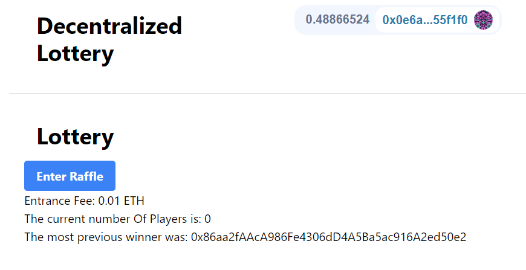

# NextJS Smartcontract Lottery FCC

This repository is linked with the [hardhat-smartcontract-lottery-fcc](https://github.com/Jitumani073/Hardhat-Smartcontract-Lottery-FCC) smart contract.
This is an user interface to interact with the Lottery smart contract.



[Example App here!](https://dawn-king-4366.on.fleek.co/)

# Getting Started

## Quickstart

```
git clone https://github.com/Jitumani073/nextjs-smartcontract-lottery-fcc
cd nextjs-smartcontract-lottery-fcc
yarn
yarn dev
```

# Usage

1. Run your local blockchain with the lottery code

> In a different terminal / command line

```
git clone https://github.com/Jitumani073/Hardhat-Smartcontract-Lottery-FCC
cd Hardhat-Smartcontract-Lottery-FCC
yarn
yarn hardhat node
```

2. Add hardhat network to your metamask/wallet

- Go to your wallet and add a new network. [See instructions here.](https://metamask.zendesk.com/hc/en-us/articles/360043227612-How-to-add-a-custom-network-RPC)

Ideally, you'd then [import one of the accounts](https://metamask.zendesk.com/hc/en-us/articles/360015489331-How-to-import-an-Account) from hardhat to your wallet/metamask.

3. Run this code

Back in a different terminal with the code from this repo, run:

```
yarn dev
```

4. Go to UI and have fun!

Head over to your [localhost](http://localhost:3000) and play with the lottery!

# Deploying to IPFS

1. Build your static code.

```
yarn build
```

2. Export your site

```
yarn next export
```

3. Deploy to IPFS

- [Download IPFS desktop](https://ipfs.io/#install)
- Open your [IPFS desktop app](https://ipfs.io/)
- Select `import` and choose the folder the above step just created (should be `out`)

4. Copy the `CID` of the folder you pinned

5. Get [IPFS companion](https://chrome.google.com/webstore/detail/ipfs-companion/nibjojkomfdiaoajekhjakgkdhaomnch?hl=en) for your browser (or use [Brave Browser](https://brave.com/))

6. Go to `ipfs://YOUR_CID_HERE` and see your ipfs deployed site!

# Deploy to IPFS using Fleek

You can also have [Fleek](https://fleek.co/) auto-deploy your website if you connect your github. Connect to fleek and follow along the docs there. You'll get an IPFS hash and a "regular" URL for your site. 

# Thank you!
